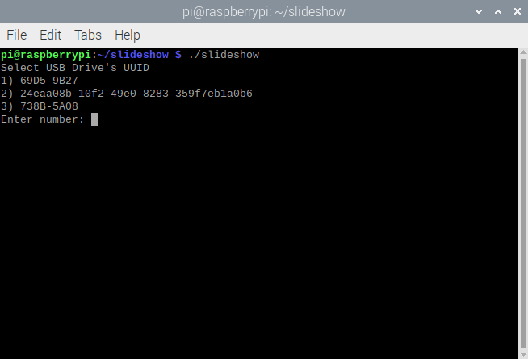

# RaspberryPi Slideshow Bash Script

A small bash script that takes JPG pictures from a USB drive and stores them in
a folder and displays them in a slideshow. **RaspberryPi operating system must be running Raspbian with desktop.**

## Installation/Setup

1. `git clone https://github.com/akilhylton/slideshow.git`
	* `sudo chmod 755 requirements.sh`
	
	* `./requirements.sh`

2. `mkdir ~/Desktop/pictures`

3. `cd ~/slideshow`
	### Find USB Device's UUID
	* `sudo blkid -sUUID` (remember to have usb drive plugged in)

4. `chmod 755 slideshow`

5. `./slideshow` (quick test remember to have a usb drive with pictures stored in a folder named **usb** plugged into the RaspberryPi)




## Run bash script on RaspberryPi start up

1. `cd ~/` (goes to home directory)

2. `mkdir /home/pi/.config/autostart`

3. `nano /home/pi/.config/autostart/slideshow.desktop`

Copy the following code to **slideshow.desktop**.
```
[Desktop Entry]
Type=Application
Name=Slideshow
Exec=lxterminal -e /home/pi/slideshow/slideshow
```
Save and exit **slideshow.desktop**.

4. `sudo reboot`
